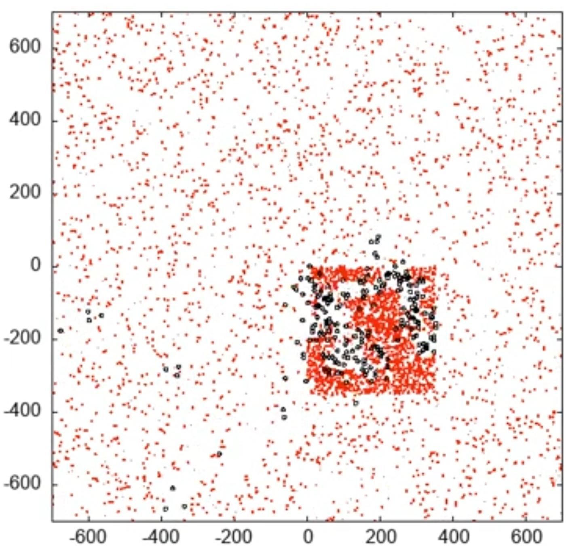

<div align="center">

# BICHIN
[](https://github.com/nsalazard/BICHIN/graphs/contributors)


<span style="color:red">B</span>iosimulación <span style="color:red">I</span>ntegrada de <span style="color:red">C</span>riaturas en <span style="color:red">H</span>ábitats <span style="color:red">IN</span>formáticos

</div>

This is a simulation that shows the effect of the environment on darwinian evolution. In particular it simulates macrophages in a sea of bacteria inspired by the work done in [Computer recreations](https://www.scientificamerican.com/article/computer-recreations-1989-05/) by A. K. Dewdney.

The simulation shows the behavior of evolution given a system where macrophages move according to a set of numbers that codify the probability of moving in a certain direction (Genes). A macrophage has the ability to eat (gaining energy), move (consuming energy) and reproduce (consuming a lot of energy). When a macrophage's internal energy reaches zero, it dies. When it reproduces, the child macrophage will inherit energy from the parent as well as their Genes, but with a random modification to the values (simulating genetic mutation). 

The simulation is finished and works as expected. It has been shown to replicate behaviors like r-k selection when changing gestation time, as wells a predator-prey population oscitation to name a few. 

## Use
To run the simulation, in the working directory you should have:
- Simulacion_Bichines.cpp &rightarrow; where the simulation runs
- Random64.h &rightarrow; The random number generator we used
- (optional) 2 empty folders named "Nodos" and "Edges" &rightarrow; Where nodes and edges data will be stored if the folders exist

These file can be downloaded from the "BICHIN_exe_pack" folder in this repo.

Compile with any c++ compiler and run as any other program. The executable outputs several files, we recommend to have at least 10GB of available storage if you want all the data to be stored. (we are working on this) 

### Setting up the simulation
This simulation can run multiple environments with out modifying the code. Running with no command line arguments will run the default simulation. 
The food distribution in the simulation depends on one parameter:
```cpp
int food_dis;
```
it uses 0 as default and is changed as the first command line argument.
| food_dis | Distribution  |
| -------- | --------------| 
| 0        | uniform       |
| 1        | gaussian      | 
| 2        | Garden of eden| 

if running several scenarios, you may need to change the name of the files every time you want to try a new scenario given the files will be rewritten.

`TMAX` is the amount of time iterations the simulation will run for. 10 000 by default and is changed with the second command line argument.

`rand_seed` is the seed for the random generator and is changed with the third command line argument, it has to be a integer.


### Visualization
If you wanted to see the evolution process like this.


<p align="center">
  
</p>

You will need to open the .gp file created by the executable with [Gnuplot](http://www.gnuplot.info). Note that this can take a long time to render.


## Run Time and population
As with a real ecosystem there is a carrying capacity and this is the real variable in terms of compute time. For example, given Nfood = 20k, Biome_energy=50k, this system will have a carrying capacity of around 1700 bugs, without any optimization and running on a HDD this configuration takes around 2h for TMAX=10k. 


This can be pretty intensive in terms of getting the data out of the simulation, with increasing numbers of bugs the longest operation is writing the data to disk, is recommended to use an SSD and to compile with the -O3 flag. 

Runtime can be improved in the future by changing writing formats from .txt files to .bin files and parallelizing the for loops. (we are working on this) 

## Stability
During testing, we realized total extinction was a possibility, given random initial genes there needs to be enough food for the bugs to go around and feed themselves through random chance and reproducing before dying, this translated that there needs to be a high enough food density  for this to happen, the way to change this is the parameter `Biome_energy`. This is a measure of the total energy in the system, and all the energy that is not held by bugs is dispersed in the system as new bacteria so energy is constant. Increasing `Biome_energy` (60k by default) will result in a total higher carrying capacity but it may be needed to survive the first few hundred time steps while the initial adaptations kick in. 


